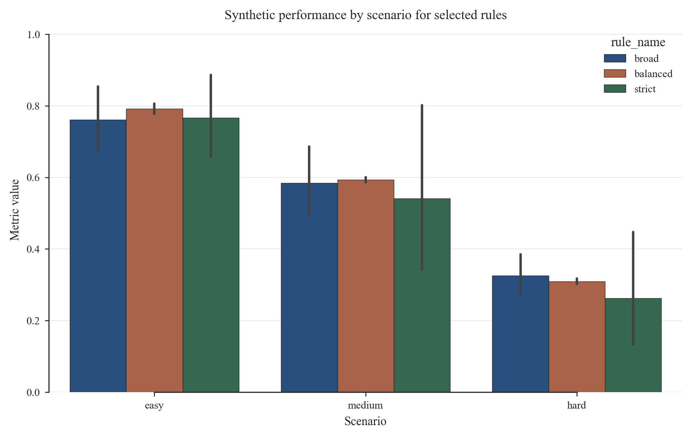
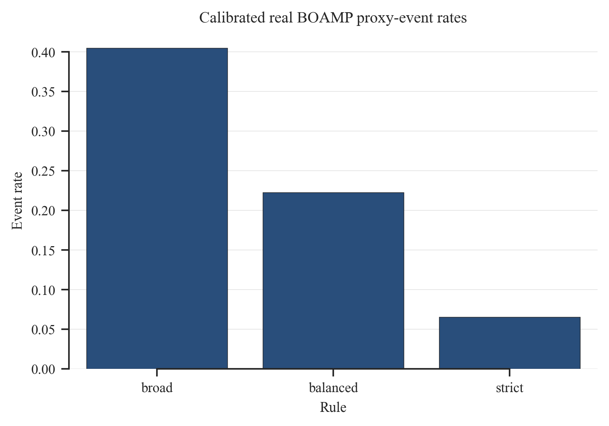
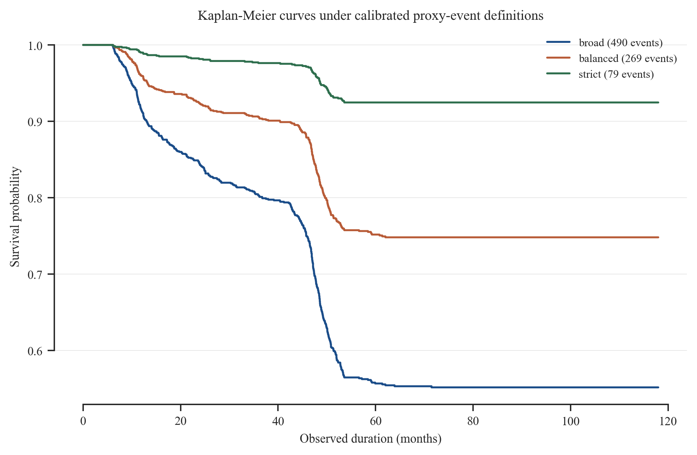

# Phase 1 Data Quality Report
## BOAMP Procurement Renewal Linking — Pays-de-la-Loire (2015–2024)

**Prepared:** 2026-06-17  
**Dataset:** `data/processed/boamp_phase2_survival_method_m2_balanced.csv` (selected main); `boamp_phase2_survival_method_m0_balanced.csv` (conservative baseline)  
**Study period:** 2015-01-01 to 2024-12-31  
**Scope:** Digital/ICT contracts (CPV divisions 48, 72, 32, 35), Pays-de-la-Loire (departments 44, 49, 53, 72, 85)

---

## Method-Comparison Update — Current Recommended Event Definition (2026-07-08)

### Why this changed: from linkage quantity to analytical reliability

**Initial method and its results.** The original linking rule accepted any
later same-buyer notice with a non-negative composite score after a soft
text-similarity filter. It gave 665 linked events among 1,210 eligible
contracts (55.0%), against a 7.6% lexical baseline — a large apparent gain.

**Challenge discovered.** BOAMP has no field certifying that one notice
renews another, so 55.0% could not be checked against ground truth. A manual
audit of 150 stratified cases against the full official BOAMP record
(2026-07-02) found the rule was too permissive: raw precision was only
≈0.15 (weighted ≈0.09 over the 665-event population), rising to 0.50 in the
high-confidence tier and to 1.00 only above text similarity 0.80; 12.8% of
decided-unlinked sources also hid a plausible missed renewal (§7 below). The
rule optimized for *linking rate*, not *link correctness* — and there is no
legal ground truth against which any single real link can be proven correct.

**Reason for changing method.** Since no certified renewal label exists for
BOAMP, precision/recall cannot be measured on the real data directly. The
project therefore built a **synthetic BOAMP-like benchmark** with recurrence
truth known by construction, so candidate rules could be compared on
measurable precision/recall/F1 before being re-applied to real BOAMP. The goal
shifted from "detect every true renewal" to "construct a reliable, calibrated
proxy-event definition."

**New calibrated method.** The synthetic benchmark generates synthetic source
and candidate notices with an explicit true-link table under three difficulty
scenarios (easy, medium, hard), reproducing the observed BOAMP failure modes
(buyer-name variation, generic/drifting CPV, missing fields, short/paraphrased
text, timing shifts, large-buyer ambiguity). It is scored with the **same
Sentence-Transformer encoder as the real pipeline**
(`paraphrase-multilingual-MiniLM-L12-v2`). A full threshold grid was scored and
three explicit rules were selected — broad, balanced, strict. In the
method-comparison experiment this rule family is called **M0**; its balanced
member (below) was the recommended input until 2026-07-08 and is now the
conservative baseline. Neither is the older 665-event baseline, which is
historical only. M0 balanced parameters:

| Parameter | Value |
|---|---|
| Text similarity threshold | 0.50 |
| Temporal window | W = 6 months |
| Composite-score threshold | 0.50 |
| Margin threshold | none |
| Generic CPV rule | corrected: generic codes do not receive exact-match credit |

On the synthetic benchmark, M0 balanced scores precision/recall/F1 of
0.777/0.806/0.791 (easy), 0.601/0.586/0.593 (medium), and 0.318/0.302/0.310
(hard) — chosen over broad and strict for its stability across scenarios and
its yield of real events, not because it is the single most precise option on
paper (see figure below).



**Results after the change.** Re-applied to real BOAMP, the balanced rule
gives **269 proxy recurrence events** among **1,210 eligible BOAMP source
contracts** (22.2%) — down from 665 (55.0%) under the initial rule. Broad and
strict sensitivity rules are retained: broad = 490 events (40.5%), strict = 79
events (6.5%, flagged LOW_EVENTS). All three calibrated datasets pass the
survival-readiness integrity checks.

The 2026-07-08 method-comparison notebook then compared the calibrated
composite rule (M0) with probabilistic linkage (M1) and active-learning-assisted
linkage (M2), with the synthetic pairs scored by the same Sentence-Transformer
encoder as the real pipeline. M1/M2 balanced improve benchmark-estimated
precision/recall to 0.612/0.733 (vs 0.575/0.568 for M0 balanced) in every
scenario, and M2 balanced also lowers the real-data negative-control
acceptance rate (7.9% vs 9.4%). The final recommendation **promotes M2
balanced to the main method** (254 events, 21.0%), via a transparent
promotion rule whose selection score deliberately excludes mapped
manual-audit precision: the 150-case audit sample was stratified on the
pre-calibration baseline's own links and confidence tiers, so it is a
baseline-anchored plausibility diagnostic, not an independent validation set
for comparing M0, M1, and M2. **M0 balanced is retained as the conservative
transparent baseline** sensitivity; M1 (which never uses audit labels) shows
nearly identical gains, confirming the promotion does not rest on
audit-informed training.



The survival rerun shows the KM median is not reached under any current
definition. Under the selected M2 balanced method, survival is 95.6% at 12
months, 92.1% at 24 months, 90.3% at 36 months, 84.0% at 48 months, and 76.0%
at 60 months; the official reduced-spec Cox C-index is 0.553 (richer
category-aware spec 0.606), and LogNormalAFT is the best AFT model by AIC
(3,357.9 in the method-comparison rerun; Weibull 3,404.4, tested but not
retained). Under the M0 balanced baseline the corresponding figures are 269
events, 12-month survival 95.9%, C-index 0.544 (richer spec 0.592), and
LogNormalAFT AIC 3,542.5 — AIC values are not comparable across event
definitions. The Schoenfeld test on the official reduced spec flags a PH
violation for `declared_duration_months` only (p<10⁻²⁴, both methods); the
log-normal AFT is used as the PH-assumption-free cross-check. Operational risk
indicators score 1,204 contracts under M2 balanced, with median 12-month risk
0.0206 and median 24-month risk 0.0634 (M0 balanced baseline: 0.0198 and
0.0624). These results describe algorithm-identifiable proxy recurrences, not
verified renewal-chain outcomes.



**Limitation.** Because BOAMP does not provide an official renewal label, the
constructed `event` variable — under any of the three rules — should be
interpreted as a proxy for likely procurement recurrence, not as verified
renewal-chain ground truth. The synthetic benchmark quantifies how the linking
method behaves under controlled noise; it does not certify that any specific
real link is an externally verified renewal-chain link.

**Conclusion.** The calibration phase's main deliverable is a change of
objective, not a single statistic: the project moved from **maximizing
linkage quantity** (665 events, 55.0%, uncalibrated) to **maximizing
analytical reliability** against a controlled benchmark (M0 balanced, 269
events, 22.2%; then the selected M2 balanced, 254 events, 21.0%). The sections
below document the original BOAMP data quality and the earlier baseline
construction. They remain useful for provenance, but the M2 balanced file is
the current modeling input and the M0 balanced file is the conservative
baseline.

---

## 1. Corpus Overview

### 1.1 Raw corpus (all notice types)

| Notice type | Count | % |
|---|---|---|
| APPEL_OFFRE (calls for tender) | 1,933 | 60.8% |
| ATTRIBUTION (award notices) | 1,081 | 34.0% |
| RECTIFICATIF (corrections) | 150 | 4.7% |
| PRE-INFORMATION | 7 | 0.2% |
| MODIFICATION | 5 | 0.2% |
| INTENTION_CONCLURE | 4 | 0.1% |
| PERIODIQUE | 1 | 0.0% |
| **Total** | **3,181** | 100% |

Raw data fetched via the BOAMP Opendatasoft Explore API (`scripts/task1b_boamp_full_fetch.py`), stored as 348 JSON files in `data/raw/boamp_full/`. All notices published 2015–2024 in the five PdL departments with digital-sector CPV codes were retained.

### 1.2 Field coverage

| Field | BOAMP fill rate | Notes |
|---|---|---|
| `objet` (contract description) | 100% | Primary NLP input for linking |
| `nomacheteur` (buyer name) | 100% | Free-text; 525 raw unique names → 502 canonical keys |
| CPV code (`cpv_principal`) | 98.1% | Missing 62 notices; missing filled from supplementary lot CPVs where possible |
| `type_procedure` | 92.9% | Covers 8 procedure types |
| Amount (`amount_eur`) | 43.0% | See §3.2 |
| Duration (`duration_months`) | 47.7% | See §3.3 |
| Buyer SIRET (`buyer_siret`) | 9.1% | Only eForms notices (2024+) carry it reliably |

---

## 2. Source Comparison: BOAMP vs DECP

Both BOAMP and DECP (Données Essentielles de la Commande Publique) were evaluated. BOAMP is the sole primary source for this study for the following reasons:

| Field | BOAMP | DECP | Decision |
|---|---|---|---|
| Study period coverage | 2015–2024 | 2018–2024 | **BOAMP** — full period required |
| Notice type granularity (AO vs award) | Yes | No | **BOAMP** — survival analysis needs this |
| Contract description (`objet`) | Rich free text, 100% | Terse, 99.9% | **BOAMP** — richer for NLP |
| Linked notices (`annonce_lie`) | 34.9% | No | **BOAMP** — key for renewal linking |
| Buyer SIRET | 9.1% | 100% | DECP better |
| Amount (EUR) | 43.0% | 95.6% | DECP better |
| Duration (months) | 47.7% | 99.4% | DECP better |

DECP was explored as an enrichment source but not included in the Phase 2 handoff because no reliable cross-source contract-level join key exists for pre-2022 BOAMP notices (no SIRET). Cross-source linking is deferred to Phase 3.

---

## 3. Cleaning Pipeline

### 3.1 Buyer key normalization

The canonical buyer key `buyer_key` follows the rule:

- `SIRET:XXXXXXXXXXXXXXX` when a valid 14-digit SIRET is available
- `NAME:ϕ(name)` otherwise, where ϕ applies: lowercase → NFD accent removal → punctuation/whitespace stripping → legal-form suffix removal (e.g., "Commune de", "SARL")

| Metric | Value |
|---|---|
| Raw unique buyer names | 525 |
| Canonical buyer keys | 502 |
| Keys with SIRET (unique buyer level) | 74 (14.7% of 502 keys) |
| Notices with SIRET-identified buyer | 156 (4.9% of 3,181 notices) |
| Keys with name-based identifier | 428 (85.3%) |

**Risk:** Name-based keys fragment buyers with typographic variants (e.g., "Ville de Nantes" vs "V. de Nantes"). This is the primary source of false negatives in renewal linking. Cross-buyer linking is not in scope for Phase 1.

### 3.2 Amount cleaning

Raw amounts were not deleted; instead, three quality flags were added:

| Flag | Condition | BOAMP count |
|---|---|---|
| `flag_amount_zero` | value == 0 | 1 |
| `flag_amount_tiny` | 0 < value < 1,000 EUR | 9 |
| `flag_amount_ceiling` | value ≥ 10,000,000 EUR | 53 |

`amount_clean` is set to NaN when any flag is True; otherwise equals the original numeric value.  
**Clean fill rate:** 41.1% (BOAMP) vs 93.1% (DECP).  
The low BOAMP fill rate reflects the mandatory reporting shift to eForms in 2024; pre-2024 BOAMP notices carry amounts only on award notices, not calls for tender.

### 3.3 Duration cleaning

`flag_duration_suspect` = 1 for values outside [1, 120] months (implausible range).  
12 notices flagged; `duration_clean` is set to NaN for those, raw value preserved.  
**Clean fill rate:** 47.3% of all notices; 52.7% of APPEL_OFFRE notices.

69.5% of available durations cluster at 12, 24, 36, or 48 months — this is an administrative reporting ceiling, not an empirical lifetime distribution, and should not be used as the survival time. The model survival time is `observed_duration_months` (gap to renewal or to study end), not `declared_duration_months`.

**Imputation rule for missing duration:** 23.4% of eligible APPEL_OFFRE notices have no declared duration. These are imputed to a default of **48 months**. The boolean flag `dur_was_imputed` marks these rows in the survival dataset.

### 3.4 Technology taxonomy

10 technology categories (CAT01–CAT10) plus "Unknown" are assigned via CPV prefix match, with keyword-in-objet fallback. Defined in `data/processed/taxonomy.csv`.

| Category | BOAMP count |
|---|---|
| CAT01 — IT Services & Consulting | 88 |
| CAT02 — Software & Applications | 167 |
| CAT03 — Telecom & Networks | 63 |
| CAT04 — Cybersecurity | 80 |
| CAT05 — Digital Workplace | 7 |
| CAT06 — Data & AI | 10 |
| CAT07 — IT Hardware & Equipment | 28 |
| CAT08 — IT Maintenance & Support | 8 |
| CAT09 — Cloud & Infrastructure | 3 |
| CAT10 — GIS & Mapping | 9 |
| Unknown | 37 |

---

## 4. Renewal Linking

### 4.1 Eligibility funnel

| Step | Count |
|---|---|
| Total BOAMP notices | 3,181 |
| APPEL_OFFRE notices | 1,933 |
| Ineligible (estimated end date after 2024-06-30) | 723 |
| **Eligible source contracts** | **1,210** |
| Historical linked proxy events (event = 1, pre-calibration) | 665 (54.96%) |
| Historical right-censored rows (event = 0, pre-calibration) | 545 (45.04%) |

A contract is eligible if its estimated end date `ê_i = start_date + declared_duration_months` satisfies `ê_i + W ≤ 2024-12-31`, where `W = 6 months` is the temporal search window. Contracts whose renewal window extends past the study end are excluded from the denominator; they are not treated as censored (the renewal window has not opened yet).

### 4.2 Algorithm summary

For each eligible source contract `i`, candidates `j` are identified by the same `buyer_key`. Each candidate pair is scored with a composite formula:

```
S(i,j) = 0.40 × text_similarity
        + 0.25 × cpv_match_score
        + 0.20 × temporal_score
        + 0.15 × buyer_match_score
```

`cpv_match_score` is a hierarchy-based CPV compatibility score (1.00 same 8-digit code → 0.80 category → 0.60 class → 0.40 group → 0.20 division → 0.00 different division; generic catch-all codes capped at 0.20). When a candidate pair has a **missing** CPV, CPV is excluded from the composite score and the remaining component weights are renormalized (divide by 0.75); it is never assigned a neutral 0.5.

**Hard filters:** `text_similarity ≥ 0.20`; gap δ(i,j) ∈ [6, 72] months.  
**Best match:** the candidate with the highest composite score is selected; `event = 1` if composite ≥ 0.0 after filtering.

Text similarity uses `paraphrase-multilingual-MiniLM-L12-v2` (Sentence-Transformers, 384-dim) cosine similarity on normalized `objet` text.

### 4.3 Baseline comparison

| Method | Linked | Eligible | Rate |
|---|---|---|---|
| Jaccard + buyer×CPV hard groupby (baseline, W=6) | 146 | 1,933 | 7.6% |
| TF-IDF cosine + buyer-only groupby (earlier W=12 pool) | 279 | 1,100 | 25.4% |
| Sentence-Transformers (this study, W=6) | 665 | 1,210 | **55.0%** |

---

## 5. Linking Rate by Technology Category

| Category | Eligible (n) | Linked | Event rate |
|---|---|---|---|
| IT Services & Consulting | 344 | 208 | 60.5% |
| Software & Applications | 223 | 140 | 62.8% |
| Telecom & Networks | 223 | 116 | 52.0% |
| Cybersecurity | 136 | 73 | 53.7% |
| Unknown | 115 | 49 | 42.6% |
| Digital Workplace & Collaboration | 51 | 32 | 62.7% |
| Data & AI | 40 | 12 | 30.0% |
| IT Maintenance & Support | 22 | 11 | 50.0% |
| IT Hardware & Equipment | 26 | 9 | 34.6% |
| Cloud & Infrastructure | 22 | 11 | 50.0% |
| GIS & Mapping | 8 | 4 | 50.0% |
| **Total** | **1,210** | **665** | **55.0%** |

The lowest event rates are in **Data & AI** (30.0%) and **IT Hardware & Equipment** (34.6%). These categories tend to have shorter, more ad-hoc procurement cycles and may be systematically underrepresented in the linked set.

### 5.1 Failure mode analysis

Among the 545 unlinked eligible contracts:

| Failure reason | Count | % of unlinked |
|---|---|---|
| NO_TEMPORAL_PARTNER | 491 | 90.1% |
| TEXT_MISMATCH | 25 | 4.6% |
| CPV_MISMATCH | 29 | 5.3% |

**NO_TEMPORAL_PARTNER** (90.1%) means no candidate from the same buyer fell within the ±6-month temporal window around the expected renewal date. This is a structural ceiling: the buyer may not have renewed, or the renewal was published outside the study window. It cannot be improved by threshold tuning. The increase vs the previous ±12-month window (84.1%) is expected: the narrower window leaves more contracts without a temporal partner.

**TEXT_MISMATCH** (4.6%) and **CPV_MISMATCH** (5.3%) identify cases where a temporal partner existed but failed the similarity or CPV check. CPV_MISMATCH counts sources whose every candidate had a valid but incompatible CPV division (score 0.0); sources with a missing CPV are excluded from this label since CPV is dropped from their composite. These are recoverable at the cost of increased false positives.

---

## 6. Confidence Tiers

Links are stratified into three confidence tiers based on composite score:

| Tier | Composite threshold | Count | % of linked |
|---|---|---|---|
| HIGH | ≥ 0.70 | 99 | 14.9% |
| MEDIUM | 0.50 – 0.70 | 301 | 45.3% |
| LOW | < 0.50 | 265 | 39.8% |

For the earlier Phase 2 sensitivity analysis, a conservative scenario dropped
LOW-tier links to `event = 0` (400 events instead of 665). After the 2026-07-05
calibration the primary analysis moved to the M0 balanced rule (269 events),
and after the 2026-07-08 method comparison to the selected M2 balanced method
(254 events), with M0 balanced as the conservative baseline.

---

## 7. Known Biases and Limitations

1. **No real BOAMP ground truth.** BOAMP has no official renewal-chain
labels. The synthetic benchmark gives controlled precision/recall because its
links are known by construction; real BOAMP still only has proxy recurrence
labels and diagnostic linking rates. The 150-case manual audit is a
plausibility diagnostic, and because its sample was stratified on the
pre-calibration baseline's own links it is baseline-anchored: mapped audit
precision cannot fairly arbitrate between linkage methods (M0/M1/M2).

2. **Buyer fragmentation.** 94.1% of buyer keys are name-based. A single public entity with naming variants across years will appear as multiple buyer keys, blocking valid links. This is the primary source of false negatives. Enriching buyer identification with SIRET/SIREN data is a planned future improvement; it requires a cross-source join not available in the current BOAMP-only pipeline.

3. **Duration imputation bias.** 23.4% of AO have missing durations imputed to 48 months. The estimated end date for those contracts is a rough guess; the temporal score and eligibility determination are less reliable for this subset. The `dur_was_imputed` flag identifies them.

4. **Right-censoring may be informative.** Unlinked contracts (event = 0) may systematically differ from linked contracts on observables (CPV, amount, buyer size). A formal diagnostic (logistic regression: event ~ covariates) was run and is reported in §9.

5. **Scope limitation.** Only BOAMP is used; DECP would improve buyer SIRET coverage and contract amounts. A cross-source join is deferred to Phase 3.

6. **False positives among LOW-tier links.** 203 links (29.1% of events) have composite < 0.50; among these, 54 have text similarity between 0.20 and 0.30, which is below the calibrated 0.30 threshold for same-contract pairs. These should be treated as uncertain in Phase 2 sensitivity analyses.

---

## 8. Phase 2 Handoff Dataset Summary

**File:** `data/processed/boamp_phase2_survival.csv`  
**Rows:** 1,210 (one per eligible APPEL_OFFRE notice)  
**Columns:** 27

Key survival columns:

| Column | Description |
|---|---|
| `event` | 1 = renewal found; 0 = censored |
| `observed_duration_months` | Survival time (gap to renewal for event=1; gap to 2024-12-31 for event=0) |
| `start_date` | Contract start (award date when available, else publication date) |
| `declared_duration_months` | Administrative declared duration (covariate, not survival time) |
| `dur_was_imputed` | True if declared_duration was missing and imputed to 48 months |
| `composite_score` | Linking confidence (non-null for event=1 only) |
| `category_label` | Technology category (11 values including Unknown) |
| `cpv_div2` | 2-digit CPV division |
| `amount_clean` | Contract amount EUR (43% fill; use with missing indicator) |

---

## 9. Selection-Bias Diagnostic

The 545 censored contracts (event = 0) may differ systematically from the 665 linked contracts (event = 1) on observables. If so, the event indicator is partly determined by contract characteristics rather than by whether a renewal occurred, which would bias Phase 2 survival estimates.

**Important caveat:** This is a diagnostic, not a causal model. It tests whether linked and unlinked contracts differ on observed covariates. It cannot test whether the linking algorithm itself introduces bias.

### 9.1 Event rate by start year

| Start year | n | Event rate (%) |
|---|---|---|
| 2015 | 116 | 60.3 |
| 2016 | 171 | 52.0 |
| 2017 | 187 | 58.8 |
| 2018 | 190 | 58.9 |
| 2019 | 181 | 59.7 |
| 2020 | 149 | 51.0 |
| 2021 | 97 | 41.2 |
| 2022 | 73 | 67.1 |
| 2023 | 33 | 24.2 |
| 2024 | 13 | 23.1 |

**Interpretation:** The 2023–2024 cohorts have notably low event rates (24.2% and 23.1%). These contracts are eligible (estimated end date ≤ 2024-06-30 at W=6) but the renewal observation window is compressed — a plausible renewal published after mid-2024 falls outside the study period. This is a structural observation ceiling, not an algorithmic failure. The 2022–2024 cohort appears in larger numbers than before (the W=6 cutoff adds contracts with est_end in H1 2024). These cohorts should be treated with caution in Phase 2. No other year shows a persistent bias relative to the overall 55.0% rate.

### 9.2 Event rate by buyer key type

All 1,210 eligible APPEL_OFFRE contracts have name-based buyer keys (`NAME:`). No SIRET-anchored contracts appear in the eligible set because BOAMP SIRET coverage is limited to eForms notices (2024+), which fall after the renewal-observation window for pre-2024 contracts. The buyer key type cannot differentiate linked from unlinked contracts in this dataset.

### 9.3 Event rate by duration imputation

| dur_was_imputed | n | Event rate (%) |
|---|---|---|
| False (declared duration available) | 915 | 55.3 |
| True (imputed to 48 months) | 295 | 53.9 |

**Interpretation:** The 1.4 pp difference is small. Imputed-duration contracts have a slightly lower event rate, consistent with less standardised procurement cycles being harder to match. This difference does not warrant excluding imputed rows from Phase 2; `dur_was_imputed` is already included as a covariate in the survival dataset.

### 9.4 Event rate by CPV division (top 10 by volume)

| CPV div | Label | n | Event rate (%) |
|---|---|---|---|
| 72 | IT services | 414 | 68.8 |
| 48 | Software | 211 | 71.1 |
| 32 | Telecom equipment | 178 | 57.9 |
| 35 | Security equipment | 77 | 53.2 |
| 45 | Construction | 61 | 45.9 |
| 30 | Office equipment | 15 | 46.7 |
| 79 | Business services | 14 | 71.4 |
| 39 | Furniture | 13 | 69.2 |
| 64 | Post/telecom services | 10 | 50.0 |
| 50 | Repair services | 9 | 66.7 |

**Interpretation:** CPV 48 (71.1%) and 72 (68.8%) — the two core digital categories — have the highest event rates. CPV 45 (construction, 45.9%) has the lowest rate among high-volume divisions; construction contracts have structurally lower renewal probability than IT service contracts. This reflects a real underlying difference in procurement cycles, not an algorithmic artifact. CPV division is included as a covariate in the Phase 2 survival model.

### 9.5 Logistic regression diagnostic

A logistic regression (`event ~ CPV division + buyer_type + declared_duration_months + start_year + dur_was_imputed`) was estimated on all 1,210 eligible contracts. Top coefficients by absolute value:

| Predictor | Coefficient | Direction |
|---|---|---|
| cpv_div2 = 90 (sanitation) | +0.80 | higher event rate |
| cpv_div2 = 37 (musical instruments) | +0.77 | higher event rate |
| cpv_div2 = 92 (recreation) | −0.72 | lower event rate |
| cpv_div2 = 43 (mining equipment) | −0.72 | lower event rate |
| cpv_div2 = 71 (architectural services) | −0.68 | lower event rate |
| cpv_div2 = 48 (software) | +0.57 | higher event rate |
| cpv_div2 = 72 (IT services) | +0.50 | higher event rate |
| cpv_div2 = 79 (business services) | +0.49 | higher event rate |

N = 1,210. Intercept ≈ −0.01. Coefficients for rare CPV divisions (n < 10) have high variance and should not be over-interpreted.

**Conclusion:** The dominant predictor of event rate is CPV division, which is substantive rather than algorithmic (different procurement categories genuinely renew at different rates). Start year and duration imputation have minimal additional effect once CPV is controlled for. No dominant unexplained residual bias was identified among the observable covariates, though the analysis cannot rule out bias driven by unobserved factors (e.g., buyer size, contract complexity). The main structural risk for Phase 2 is the 2023–2024 cohorts' compressed observation window, which `start_year` as a covariate will partially absorb. The sensitivity analyses using HIGH-confidence links only (§6) provide an additional bias check; these should be interpreted as indicative rather than definitive.
